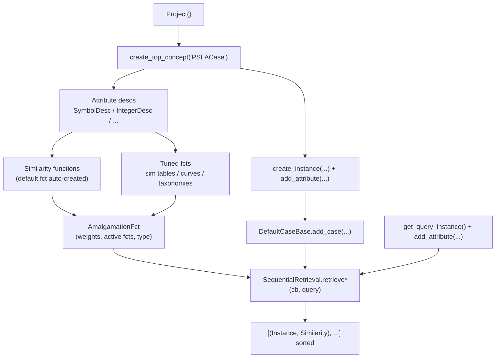

# The `cbr` Package — Python Migration of myCBR

`src/hklii_psla/cbr/` is a Python migration of the core of **myCBR**, the Java
case-based reasoning tool. The migration lives on branch `feat/python-migration`
(git history: `1e3663c` "partial implementation of classes, to be resumed from
SymbolFct" → `ab8bec6` "migrated to python"). It is a faithful port: class
names, semantics, and even quirks (asymmetric similarity tables, special
values, inheritance taxonomies) mirror the original Java.

**Current status:** the module is self-contained and functional end-to-end, but
nothing else in the repo imports it yet, it has no tests, and there is no
persistence (everything lives in memory). Two verified smoke scripts exist at
the repo root (`scratch_cbr_smoke.py`, `scratch_cbr_smoke2.py`).

---

## 1. What is going on

Case-Based Reasoning (CBR) solves new problems by retrieving the most similar
previously-seen cases. This package implements the myCBR data model for that:

| myCBR idea | Python class | File |
|---|---|---|
| Project (root of everything) | `Project` | `core/project.py` |
| Concept (a type of case, e.g. "PSLACase") | `Concept` | `core/model/concept.py` |
| Attribute description (vocabulary entry) | `SymbolDesc`, `IntegerDesc`, `DoubleDesc`, `FloatDesc`, `StringDesc`, `BooleanDesc`, `DateDesc`, `IntervalDesc`, `SpecialDesc`, `ConceptDesc` | `core/model/` |
| Case / query (an instance of a concept) | `Instance` | `core/casebase/instance.py` |
| Case base (named collection of cases) | `ICaseBase` / `DefaultCaseBase` | `core/i_case_base.py`, `core/default_case_base.py` |
| Local similarity per attribute | `SimFct` subclasses: `SymbolFct` (table), `TaxonomyFct` (tree), `OrderedSymbolFct`, `IntegerFct`/`DoubleFct`/... (curves), `StringFct`, `SpecialFct` | `core/similarity/` |
| Global similarity (combining attributes) | `AmalgamationFct` | `core/similarity/amalgamation_fct.py` |
| Retrieval engine | `SequentialRetrieval` | `core/retrieval/sequential_retrieval.py` |
| Explanation hooks | `Explainable` (stub — only name/type) | `core/explanation/explainable.py` |

Notable myCBR concepts carried over:

- **Concept hierarchy**: concepts have super/sub concepts; sub-concepts inherit
  attribute descriptions. A parallel, project-level "inheritance taxonomy"
  (`Project.get_inh_fct()`) scores how similar two *different* concepts are, so
  retrieval can compare a query against cases of sibling concepts.
- **Special values**: every attribute can be `_unknown_`, `_others_`
  (a value outside the allowed range), or `_undefined_`. Similarity involving
  special values goes through `Project.calculate_special_similarity()`.
- **Similarity value**: `Similarity` is an immutable, cached flyweight in
  `[0.0, 1.0]` (or `-1.0` = `INVALID_SIM`). Obtain instances via
  `Similarity.get(x)`, never the constructor.
- **Amalgamation types** (`AmalgamationConfig`): `WEIGHTED_SUM`, `MINIMUM`,
  `MAXIMUM`, `EUCLIDEAN`. Each concept has one *active* amalgamation function
  used at retrieval time.
- **Multiple attributes**: an attribute can hold several values
  (`desc.is_multiple = True`); `MultipleConfig` (BEST_MATCH / WORST_MATCH /
  PARTNER_* strategies, REUSE/ZERO_SIM, AVG/MAX/MIN) governs how sets are
  compared.

## 2. How data flows



Step by step:

1. **Define the vocabulary** — `Project()` → `Concept` → attribute
   descriptions. Constructing a `SymbolDesc`/`IntegerDesc`/... automatically
   registers it on the owning concept and creates a *default* similarity
   function for it.
2. **Tune similarity** — add functions to descriptions
   (`desc.add_symbol_fct(...)`, `desc.add_taxonomy_fct(...)`,
   `desc.add_integer_fct(...)`), then point the concept's active
   `AmalgamationFct` at them (`set_active_fct`), set weights
   (`set_weight`) and the combination rule (`set_type`).
3. **Populate the case base** — `concept.create_instance(name)` then
   `instance.add_attribute(desc_or_name, value)` for each attribute; add the
   instance to a `DefaultCaseBase`.
4. **Query & retrieve** — `concept.get_query_instance()` (a special instance
   named `"query"` that is *not* stored in the concept), fill in known
   attributes, then `SequentialRetrieval(prj).retrieve_sorted(cb, query)`.

During retrieval, per-attribute similarities are computed by the active local
fct, combined by the concept's active amalgamation fct, and — if the case
belongs to a different concept than the query — scaled by the project's
inheritance taxonomy similarity (`retrieve()` only; see quirks below).

## 3. How to start using it

The package has no `__init__.py` files (implicit namespace packages) — imports
work directly. Run scripts with `uv run python <script>` (in this sandbox,
`uv`'s cache is blocked, so use `.venv/bin/python` instead).

Verified end-to-end example (this is `scratch_cbr_smoke.py` at the repo root):

```python
from hklii_psla.cbr.core.project import Project
from hklii_psla.cbr.core.model.symbol_desc import SymbolDesc
from hklii_psla.cbr.core.model.integer_desc import IntegerDesc
from hklii_psla.cbr.core.similarity.config.amalgamation_config import AmalgamationConfig
from hklii_psla.cbr.core.retrieval.sequential_retrieval import SequentialRetrieval

# 1. vocabulary
prj = Project()
concept = prj.create_top_concept("PSLACase")
severity = SymbolDesc(concept, "severity", {"minor", "moderate", "severe"})
age = IntegerDesc(concept, "age", 0, 100)

# 2. case base + cases
cb = prj.create_default_cb("cases")
for name, sev, a in [("case1", "moderate", 30), ("case2", "severe", 45), ("case3", "minor", 25)]:
    c = concept.create_instance(name)
    c.add_attribute("severity", sev)
    c.add_attribute("age", a)
    cb.add_case(c)

# 3. tune similarity
sev_fct = severity.add_symbol_fct("sev_sim", False)
sev_fct.is_symmetric = True            # IMPORTANT: see quirks
sev_fct.set_similarity("minor", "moderate", 0.5)
sev_fct.set_similarity("moderate", "severe", 0.5)

amalgam = concept.get_active_amalgam_fct()
amalgam.set_type(AmalgamationConfig.WEIGHTED_SUM)
amalgam.set_active_fct(severity, sev_fct)
amalgam.set_weight("severity", 2.0)
amalgam.set_weight("age", 1.0)

# 4. query & retrieve
query = concept.get_query_instance()
query.add_attribute("severity", "moderate")
query.add_attribute("age", 35)

for inst, sim in SequentialRetrieval(prj).retrieve_sorted(cb, query):
    print(inst.name, sim.value)
```

For numeric similarity you almost always want to replace the default (see
quirks):

```python
from hklii_psla.cbr.core.similarity.config.number_config import NumberConfig

age_fct = age.add_integer_fct("age_sim", False)
age_fct.set_function_type_r(NumberConfig.POLYNOMIAL_WITH)
age_fct.set_function_parameter_r(2.0)   # (1 - |d|/range)^2, verified 0.16 for 20 vs 80
age_fct.set_function_type_l(NumberConfig.POLYNOMIAL_WITH)
age_fct.set_function_parameter_l(2.0)
amalgam.set_active_fct(age, age_fct)
```

### Integration path for this repo

Natural next step: map extracted `Case` features (`schemas.py`) to CBR
attributes — injuries/loss categories (the 27-category taxonomy) as symbol
attributes, plaintiff age as an integer attribute, PSLA award as the *solution*
attribute (`desc.is_solution = True`), and use the benchmark gold JSON to
populate the case base. Retrieval then gives comparable precedents for a new
case.

## 4. Quirks & gotchas (verified)

1. **Default numeric similarity is constant 1.0.** `IntegerFct`/`DoubleFct`/...
   default to `NumberConfig.CONSTANT` with parameter `1.0` — *any* two
   in-range values are fully similar. Always add and configure a numeric fct
   if distance should matter.
2. **Similarity tables are asymmetric by default.** `SimFct._is_symmetric`
   starts `False`, so `set_similarity("minor", "moderate", 0.5)` only sets
   `sims[minor][moderate]`; `sims[moderate][minor]` stays 0.0. Set
   `fct.is_symmetric = True` first (or set both directions).
3. **`retrieve_k` ignores cross-concept inheritance.** `retrieve()` scales
   similarity by the project's inheritance taxonomy when query and case have
   different concepts; `retrieve_k`/`retrieve_k_sorted` use the query concept's
   amalgamation directly. Fine for a single-concept case base, surprising
   otherwise.
4. **No persistence.** There is no save/load (myCBR's project XML is not
   ported); rebuild the model in code or add serialization yourself.
5. **`Instance.add_attribute` is lenient.** It accepts a desc object or name,
   a raw value or `Attribute`, and silently returns `False` on mismatch
   (unknown name, value outside range). Check the return value when debugging.
6. **`Similarity` is a cached flyweight** — use `Similarity.get(x)`; values
   outside `[0, 1]` (other than `-1.0`) collapse to `INVALID_SIM`.
7. **No tests / no imports.** Nothing in `tests/` or `src/` exercises this
   package yet; the two `scratch_cbr_smoke*.py` scripts are the only
   verification.
